 
## 查看主页获取源码

> **作者介绍**： **✌**全网粉丝10W+本平台特邀作者、博客专家、CSDN新星计划导师、java领域优质创作者,博客之星、掘金/华为云/阿里云/InfoQ等平台优质作者、专注于项目实战 **✌**

  

### 一、作品包含

源码+数据库+设计文档万字+PPT+全套环境和工具资源+部署教程

### 二、项目技术

前端技术：Html、Css、Js、Vue、Element-ui

数据库：MySQL

后端技术：Java、Spring Boot、MyBatis

  

### 三、运行环境

开发工具：IDEA/eclipse + 微信开发者工具

数据库：MySQL5.7

数据库管理工具：Navicat10以上版本

环境配置软件： JDK1.8+Maven3.6.3

前端Nodejs：14

### 四、项目介绍
项目编号：mpweixinA022

宠物中心信息管理为广大宠物主人提供便捷、高效的一站式宠物服务。通过这款应用，用户可以轻松管理宠物的基本信息，让宠物主人省心省力，为爱宠营造一个美好的生活空间。

前台用户功能：首页、宠物领养、宠物洗美、宠物寄养、宠物医疗、宠物商城、我的。

后台管理员的功能：系统首页、个人中心、会员管理、宠物信息管理、宠物类型管理、宠物领养管理、领养申请管理、宠物洗美管理、项目类型管理、洗美预约管理、宠物寄养管理、寄养宠物管理、宠物医疗管理、宠物医疗项目管理、问诊预约管理、宠物商城管理、商品分类管理、商品购买管理、投诉建议、系统管理。

### 五、运行截图

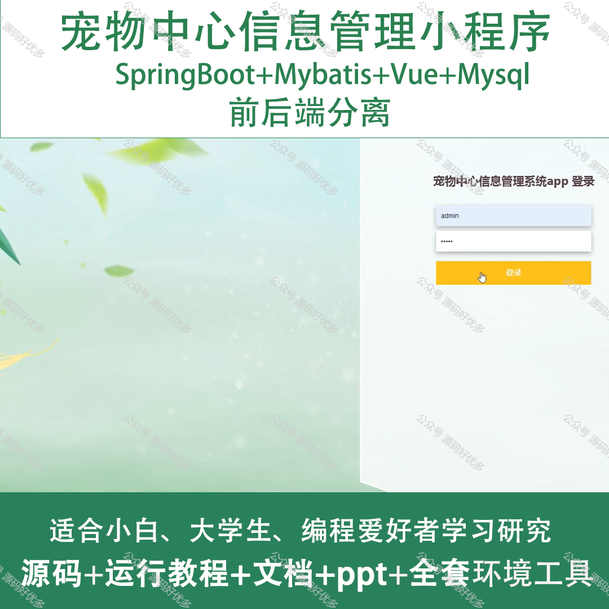
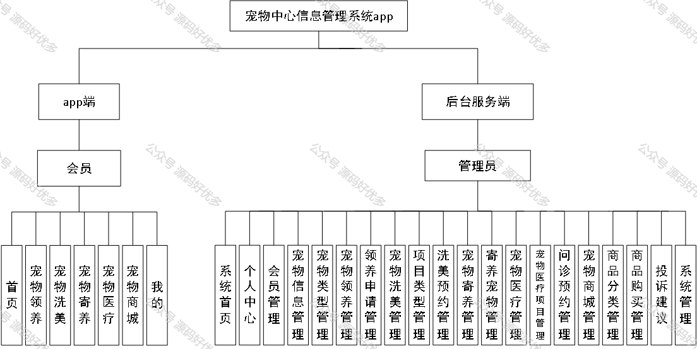
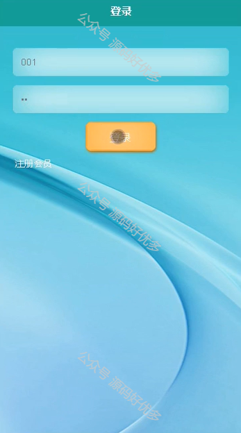
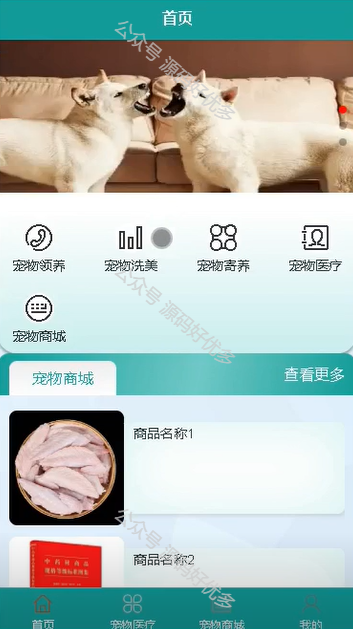
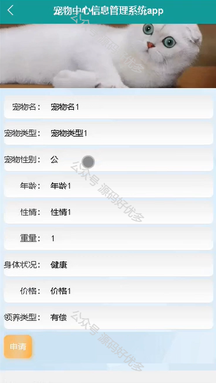
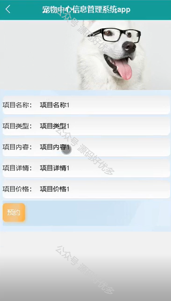
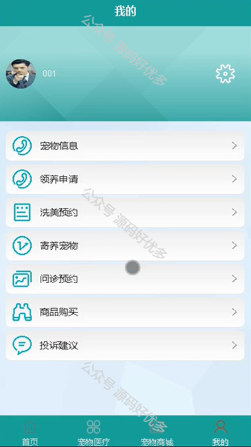
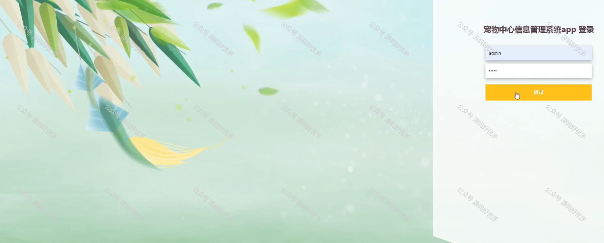
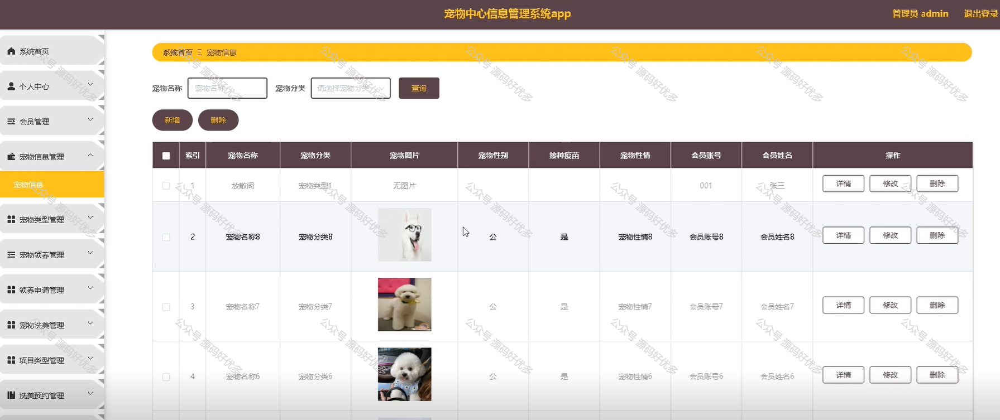
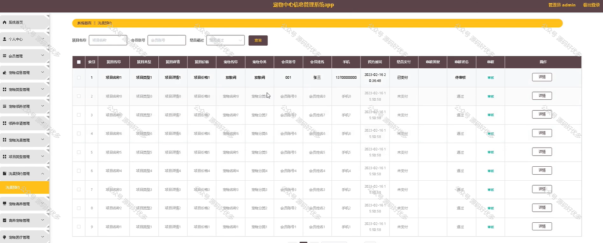
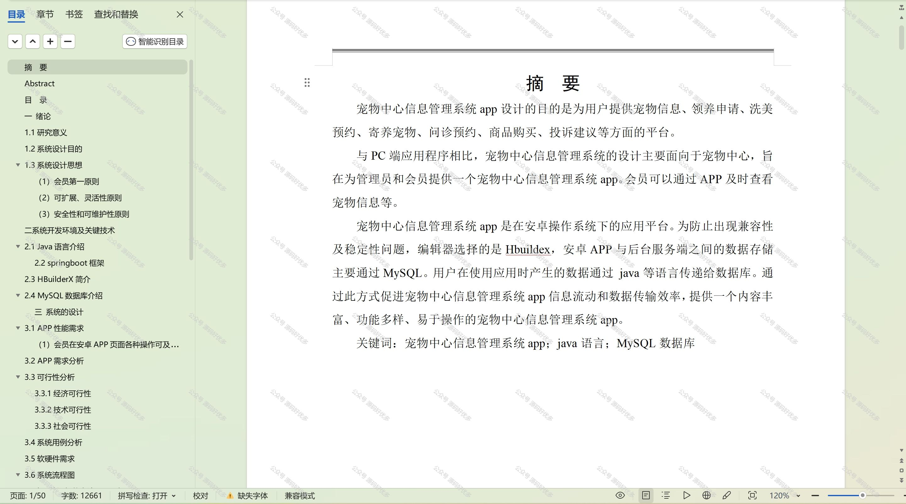

  
